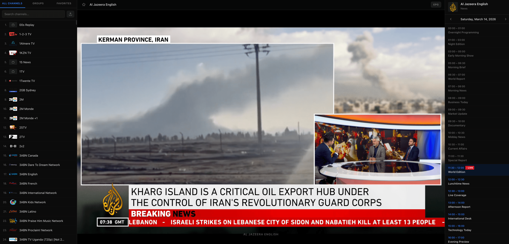

# 📺 IPTV-LD



## 🌟 Overview

**IPTV-LD** is a high-performance, modern web-based IPTV player built with **Next.js 15** and **React 19**. Designed for speed, aesthetics, and reliability, it provides a premium experience for streaming M3U/M3U8 playlists directly in your browser.

Whether you're managing thousands of channels or just your favorites, IPTV-LD handles it all with smooth virtualization and intuitive navigation.

## ✨ Key Features

-   🚀 **Ultra-Fast Performance**: Powered by TanStack Virtual for liquid-smooth scrolling, even with playlists containing 10,000+ channels.
-   📺 **Premium Video Player**: Built on Video.js and HLS.js for robust playback supporting multiple streaming formats.
-   📂 **Playlist Management**:
    -   Load remote M3U/M3U8 playlists via URL.
    -   Securely upload local playlist files.
-   📂 **Smart Grouping**: Automatically categorizes channels into groups based on M3U metadata.
-   ⭐ **Favorites System**: Keep your most-watched channels just a click away with local persistence.
-   🔍 **Optimized Search**: Instant, debounced search across all channels and groups.
-   📅 **EPG Integration**: Native support for Electronic Program Guide (EPG) visualization.
-   🎨 **Modern UI/UX**: Sleek dark-themed interface with glassmorphism effects and responsive design.

## 🛠️ Tech Stack

-   **Framework**: [Next.js 15](https://nextjs.org/) (App Router)
-   **Library**: [React 19](https://react.dev/)
-   **Styling**: [Tailwind CSS 4](https://tailwindcss.com/)
-   **State Management**: [Zustand](https://github.com/pmndrs/zustand)
-   **Video Engine**: [Video.js](https://videojs.com/) & [HLS.js](https://github.com/video-dev/hls.js/)
-   **List Virtualization**: [TanStack Virtual](https://tanstack.com/query/latest)
-   **Icons**: [Lucide React](https://lucide.dev/)
-   **Components**: [Radix UI](https://www.radix-ui.com/) & [Shadcn UI](https://ui.shadcn.com/)

## 🚀 Getting Started

### Prerequisites

-   [Node.js](https://nodejs.org/) (v18.0.0 or higher)
-   [npm](https://www.npmjs.com/), [yarn](https://yarnpkg.com/), [pnpm](https://pnpm.io/), or [bun](https://bun.sh/)

### Installation

1.  **Clone the repository**:
    ```bash
    git clone https://github.com/your-username/iptv-ld.git
    cd iptv-ld
    ```

2.  **Install dependencies**:
    ```bash
    npm install
    # or
    bun install
    ```

3.  **Start the development server**:
    ```bash
    npm run dev
    # or
    bun dev
    ```

4.  **Open the app**:
    Navigate to [http://localhost:3000](http://localhost:3000) in your browser.

## 📖 Usage

1.  **Initial Load**: By default, the app loads a sample playlist.
2.  **Custom URL**: Use the sidebar to input your own M3U playlist URL.
3.  **Local File**: Click the "Upload" icon in the sidebar to load an `.m3u` or `.m3u8` file from your computer.
4.  **Favorites**: Click the star icon next to any channel to save it to your favorites.

## ⚖️ Legal Notice & Disclaimer

**IMPORTANT READ:**

-   **IPTV-LD** is purely a media player. It does **NOT** provide, host, or include any media content, playlists, or streaming services.
-   Users are solely responsible for obtaining their own legal M3U playlists and content.
-   IPTV-LD has no affiliation with any third-party playlist providers.
-   The developers of IPTV-LD do not condone or support the streaming of copyrighted material without permission from the copyright holders.
-   Users should ensure they comply with the laws of their local jurisdiction before using this software.

## 📄 License

This project is licensed under the [MIT License](./LICENSE) - see the file for details.

---

<p align="center">Made with ❤️ for the open-source community</p>
